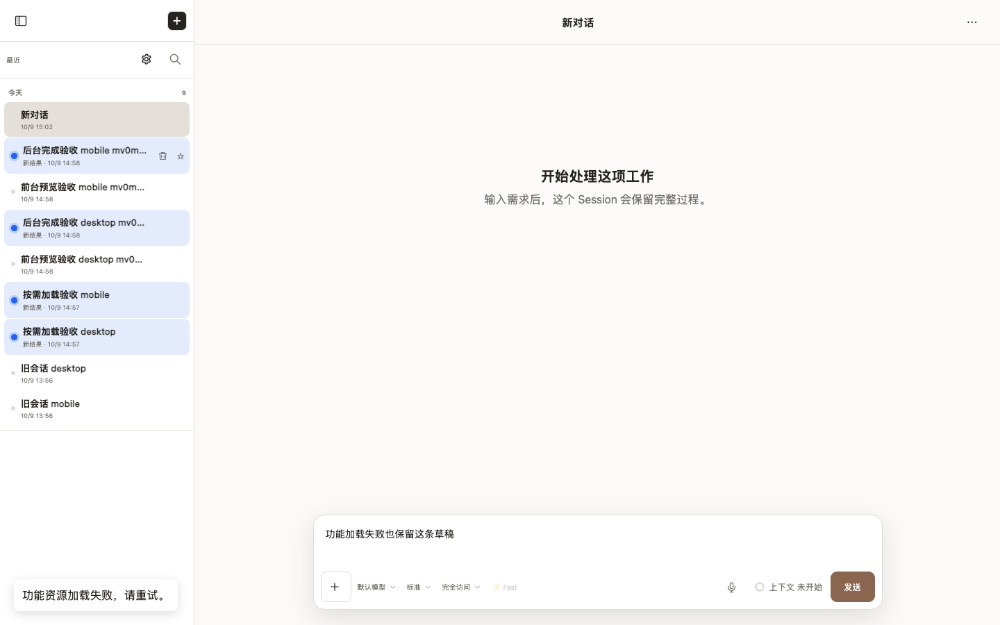
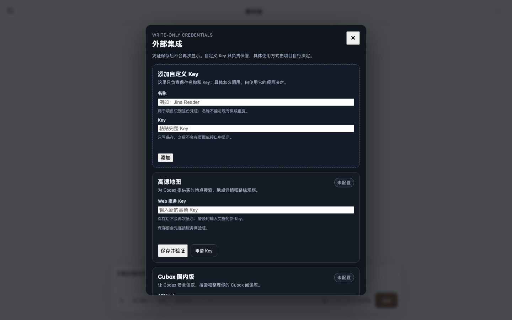
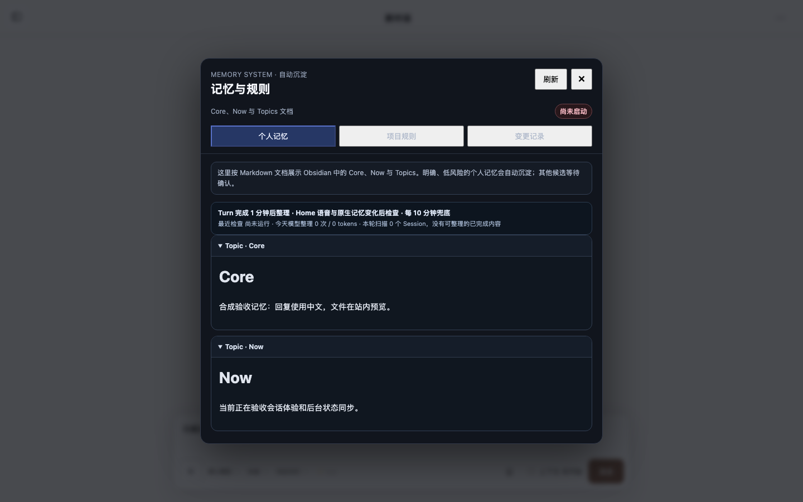
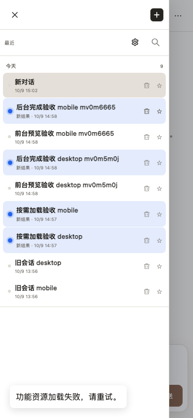
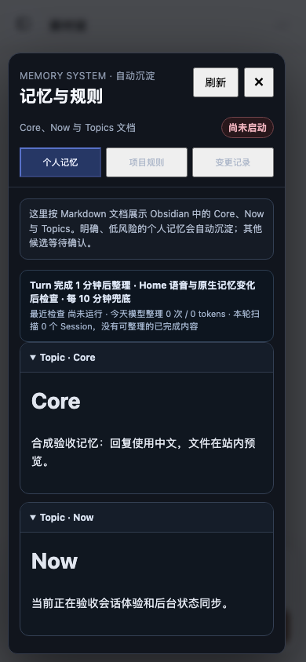

# feature-entry-lazy-load-and-retry

- Status: **passed**
- Started: 2026-10-09T07:02:48.582Z
- Flow: `/Users/mac/Documents/worktrees/CHG-20261009-003/agent-terminal-web/scripts/testing/session-lazy-features.flow.mjs`

## desktop

Viewport: 1440 × 900. Status: **passed**.

### Video

- [Segment 1](desktop/video.webm)

### Storyboard

#### 1. desktop 功能资源失败不影响草稿输入

#### 2. 再次进入集成设置可重试，首次打开才读取数据

#### 3. 记忆管理按需打开，执行时的记忆来源保持独立

## mobile

Viewport: 390 × 844. Status: **passed**.

### Video

- [Segment 1](mobile/video.webm)

### Storyboard

#### 1. mobile 功能资源失败不影响草稿输入

#### 2. 再次进入集成设置可重试，首次打开才读取数据

#### 3. 记忆管理按需打开，执行时的记忆来源保持独立

> URLs in the manifest are sanitized. Video and screenshots contain the rendered viewport; traces can contain request data and should be promoted or shared only after review.

