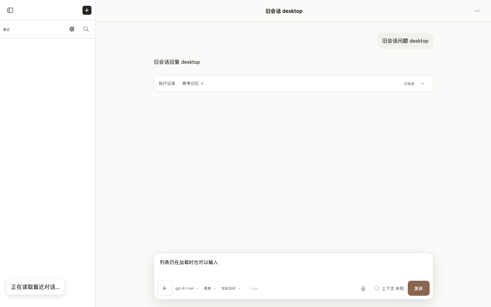
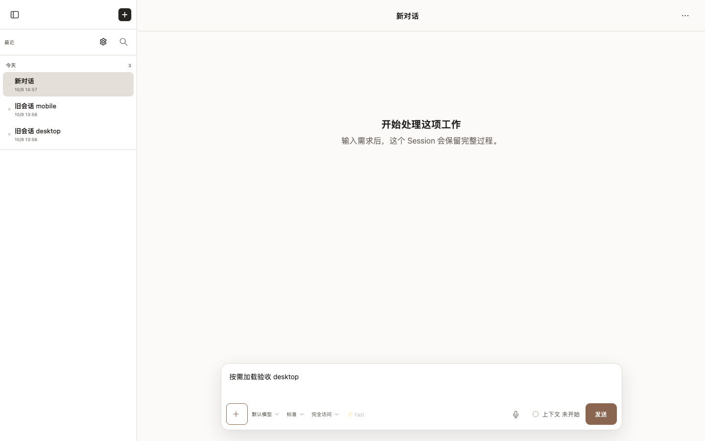
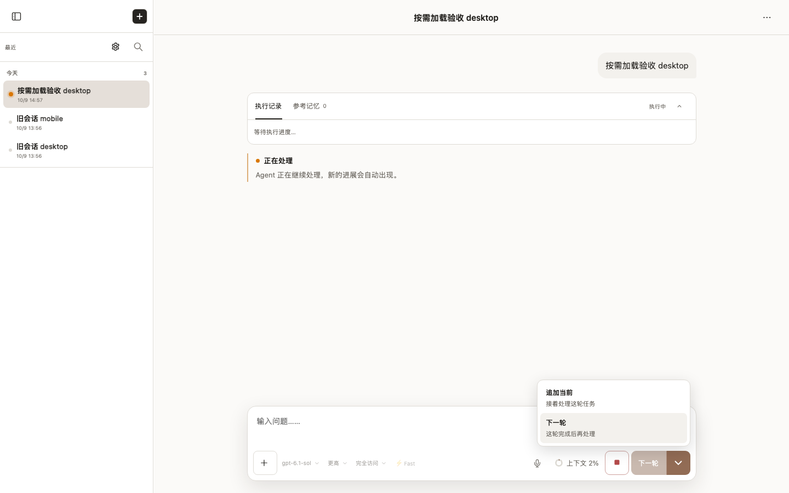
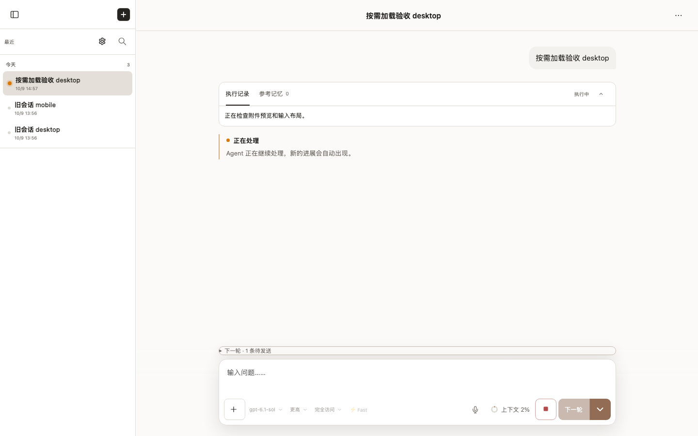
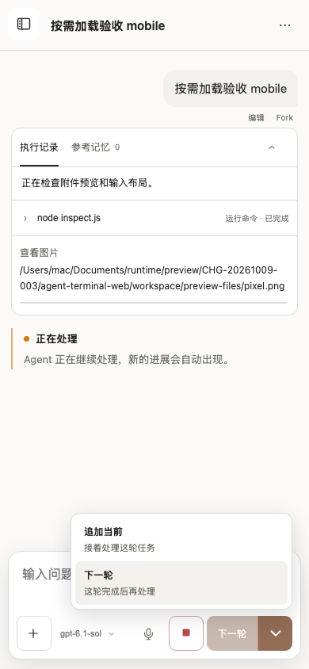
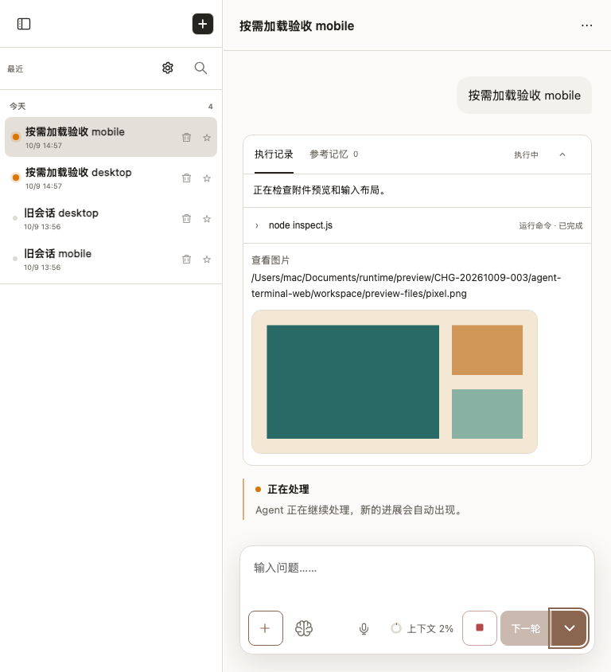

# lazy-startup-and-split-send

- Status: **passed**
- Started: 2026-10-09T06:56:59.846Z
- Flow: `/Users/mac/Documents/worktrees/CHG-20261009-003/agent-terminal-web/scripts/testing/session-lazy-loading.flow.mjs`

## desktop

Viewport: 1440 × 900. Status: **passed**.

### Video

- [Segment 1](desktop/video-01.webm)
- [Segment 2](desktop/video-02.webm)

### Storyboard

#### 1. 空白新草稿不加载正文解析、数学公式或功能管理

#### 2. 历史列表延迟时，当前会话和输入仍可用

#### 3. 新建和附件加号均不刷新页面、不读取模型

#### 4. 运行中发送方式贴近发送按钮，向上展开

#### 5. 回车遵循下一轮选择，进入待执行队列

## mobile

Viewport: 390 × 844. Status: **passed**.

### Video

- [Segment 1](mobile/video-01.webm)
- [Segment 2](mobile/video-02.webm)

### Storyboard

#### 1. 空白新草稿不加载正文解析、数学公式或功能管理

#### 2. 历史列表延迟时，当前会话和输入仍可用

#### 3. 新建和附件加号均不刷新页面、不读取模型

#### 4. 运行中发送方式贴近发送按钮，向上展开

#### 5. 320px 实际运行布局

#### 6. 390px 实际运行布局

#### 7. 768px 实际运行布局

#### 8. 回车遵循下一轮选择，进入待执行队列

> URLs in the manifest are sanitized. Video and screenshots contain the rendered viewport; traces can contain request data and should be promoted or shared only after review.

