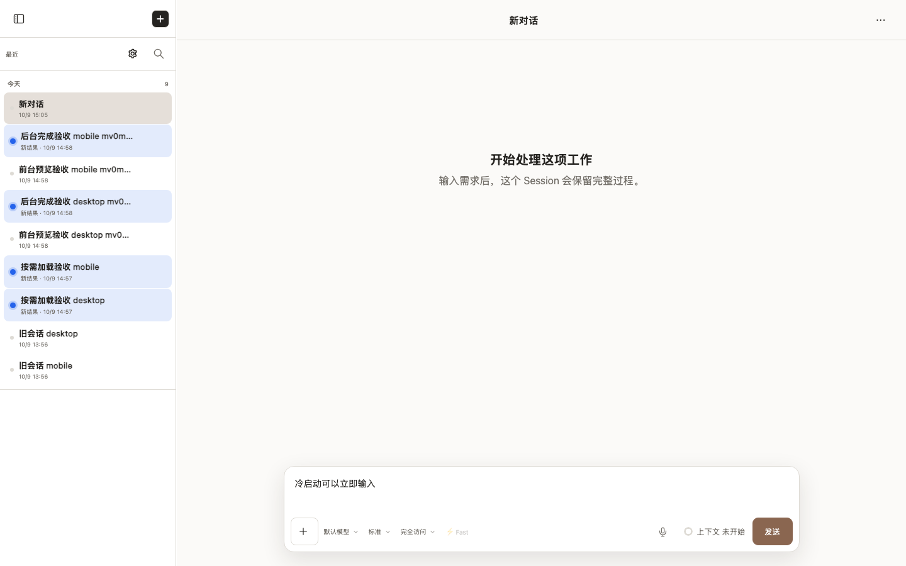
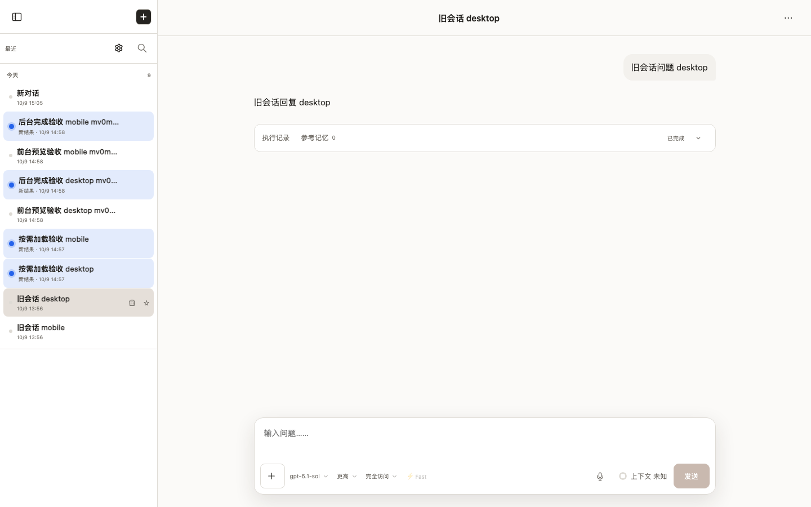

# observable-startup-timing

- Status: **passed**
- Started: 2026-10-09T07:05:48.542Z
- Flow: `/Users/mac/Documents/worktrees/CHG-20261009-003/agent-terminal-web/scripts/testing/session-startup-timing.flow.mjs`

## desktop

Viewport: 1440 × 900. Status: **passed**.

### Video

- [Segment 1](desktop/video.webm)

### Storyboard

#### 1. 冷启动已可输入

#### 2. 缓存再次打开已可输入

#### 3. 切换后最近内容可见

## mobile

Viewport: 390 × 844. Status: **passed**.

### Video

- [Segment 1](mobile/video.webm)

### Storyboard

#### 1. 冷启动已可输入

#### 2. 缓存再次打开已可输入

#### 3. 切换后最近内容可见

> URLs in the manifest are sanitized. Video and screenshots contain the rendered viewport; traces can contain request data and should be promoted or shared only after review.

