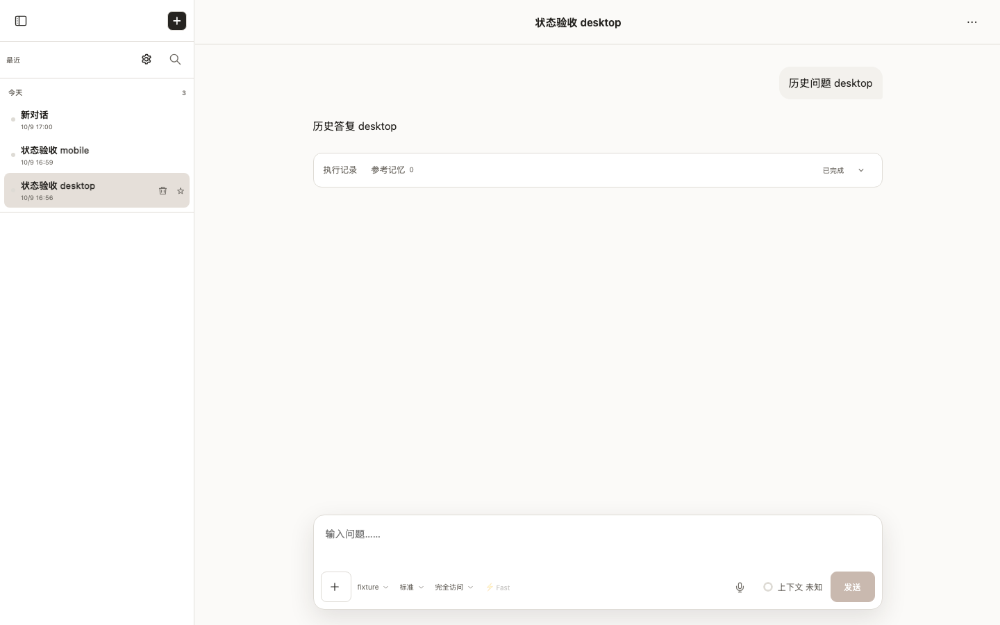
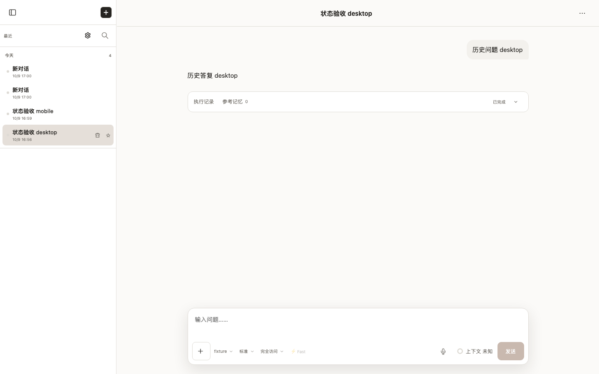
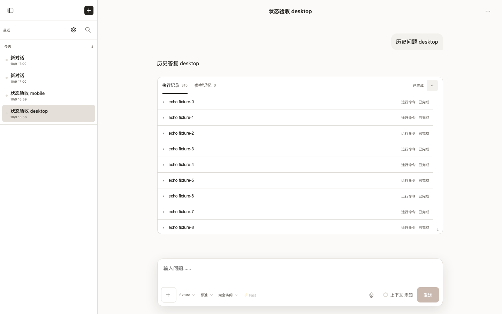
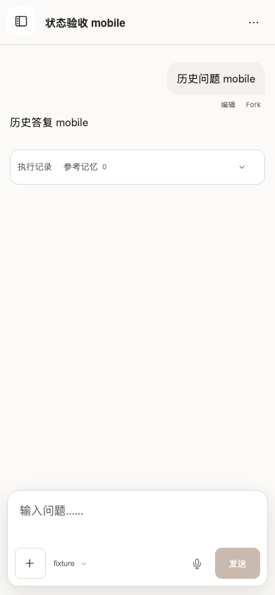
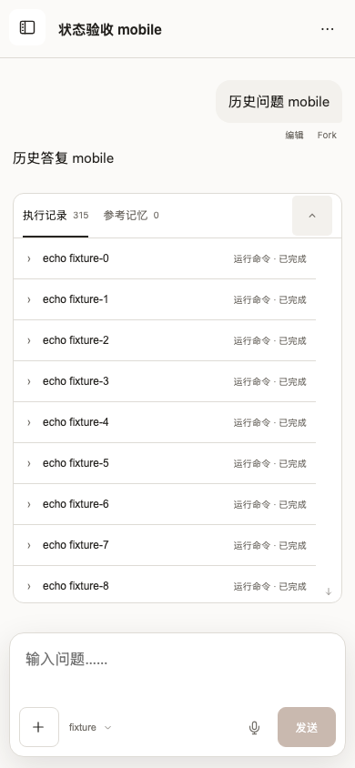

# session-selection-duration-and-demand-loading

- Status: **passed**
- Started: 2026-10-09T09:00:25.912Z
- Flow: `/Users/mac/Documents/worktrees/CHG-20261009-004/agent-terminal-web/scripts/testing/session-selection-timing.flow.mjs`

## desktop

Viewport: 1440 × 900. Status: **passed**.

### Video

- [Segment 1](desktop/video.webm)

### Storyboard

#### 1. 首次选中长会话，正文在两秒内显示

#### 2. 慢速刷新仍先显示已验证正文，五百毫秒内可见

#### 3. 展开执行记录后才读取完整历史详情

## mobile

Viewport: 390 × 844. Status: **passed**.

### Video

- [Segment 1](mobile/video.webm)

### Storyboard

#### 1. 首次选中长会话，正文在两秒内显示

#### 2. 慢速刷新仍先显示已验证正文，五百毫秒内可见

#### 3. 展开执行记录后才读取完整历史详情

> URLs in the manifest are sanitized. Video and screenshots contain the rendered viewport; traces can contain request data and should be promoted or shared only after review.

