# submission-and-native-binding-state

- Status: **passed**
- Started: 2026-10-09T09:01:07.119Z
- Flow: `/Users/mac/Documents/worktrees/CHG-20261009-004/agent-terminal-web/scripts/testing/session-state-contract.flow.mjs`

## desktop

Viewport: 1440 × 900. Status: **passed**.

### Video

- [Segment 1](desktop/video.webm)

### Storyboard

#### 1. 旧连接按需展示历史，不启动任务

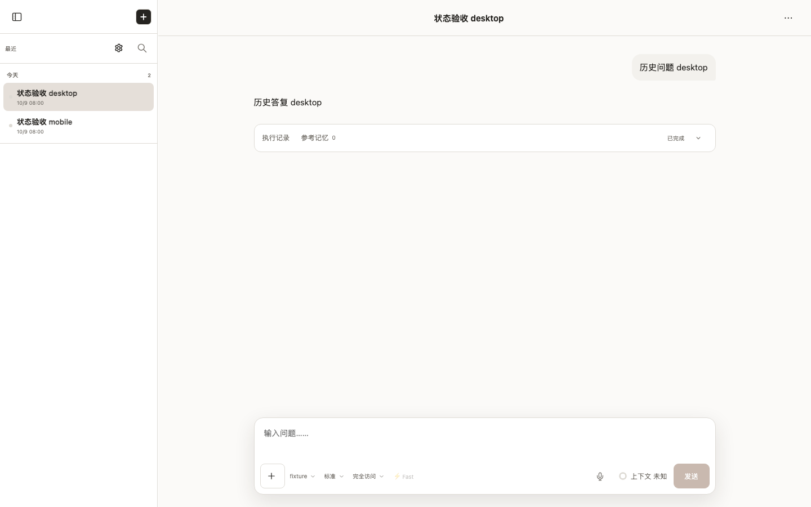

#### 2. 准备完成前用户消息立即出现

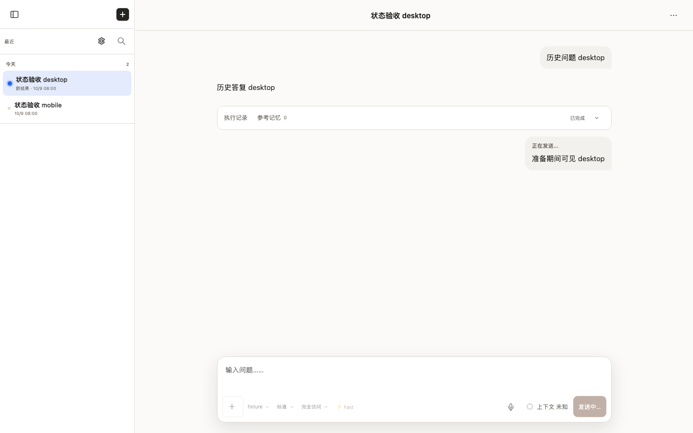

#### 3. 完成早于追加回包，迟到回包不会恢复执行中

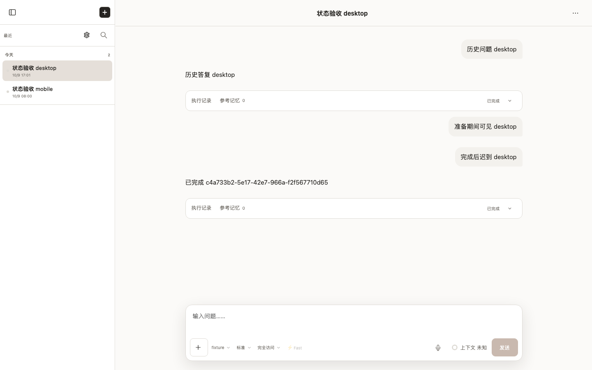

#### 4. 启动失败显示错误并恢复输入

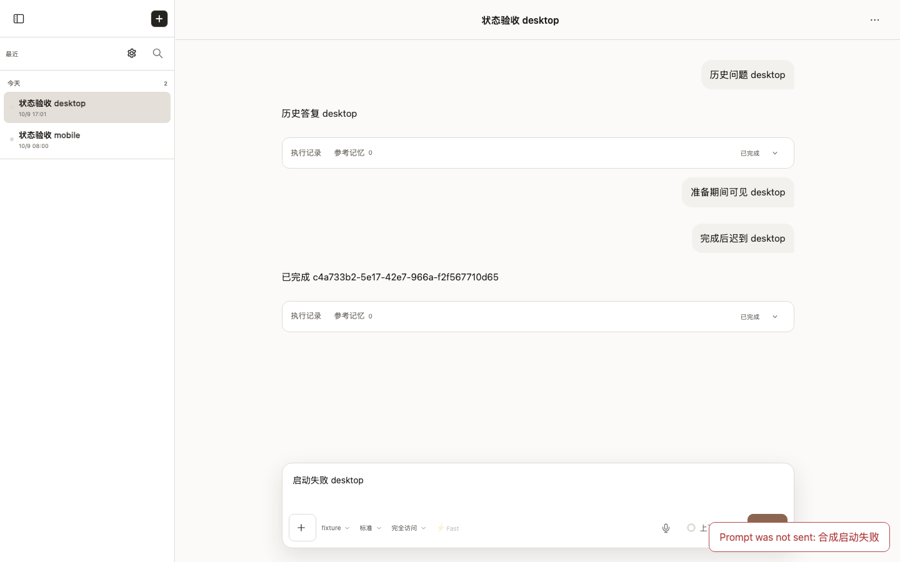

#### 5. 释放旧连接后另一端恢复，同一正文自动接到新连接

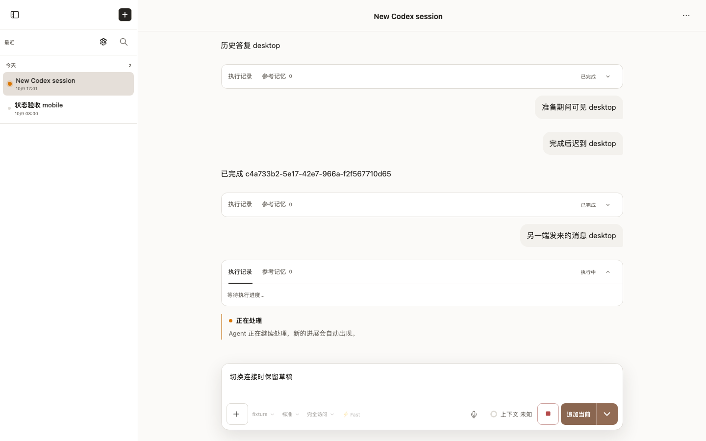

#### 6. 断线重连补齐完成状态，消息与草稿保留

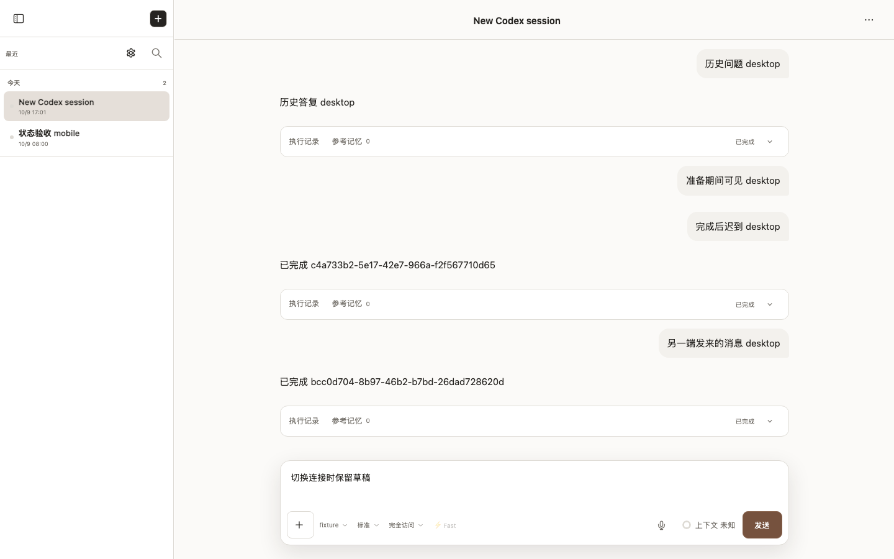

## mobile

Viewport: 390 × 844. Status: **passed**.

### Video

- [Segment 1](mobile/video.webm)

### Storyboard

#### 1. 旧连接按需展示历史，不启动任务

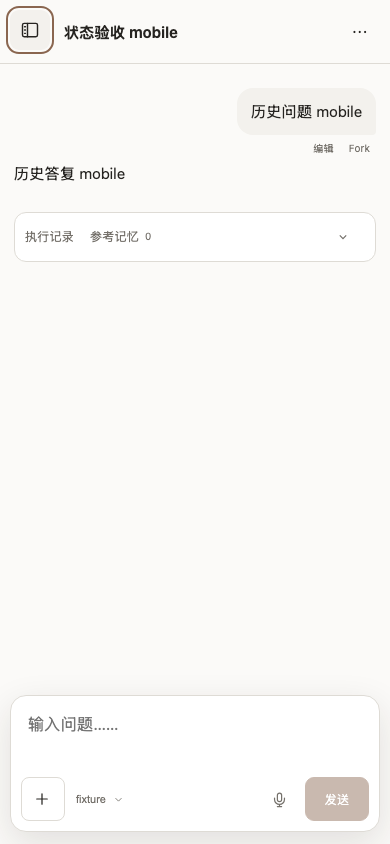

#### 2. 准备完成前用户消息立即出现

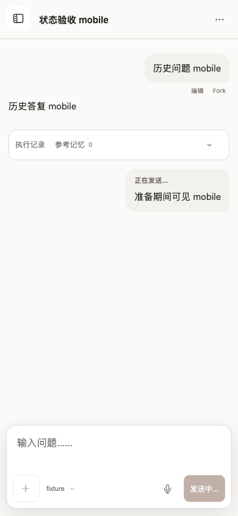

#### 3. 完成早于追加回包，迟到回包不会恢复执行中

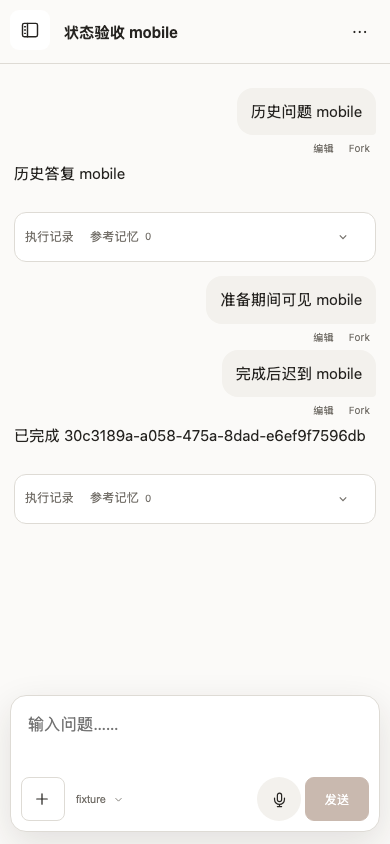

#### 4. 启动失败显示错误并恢复输入

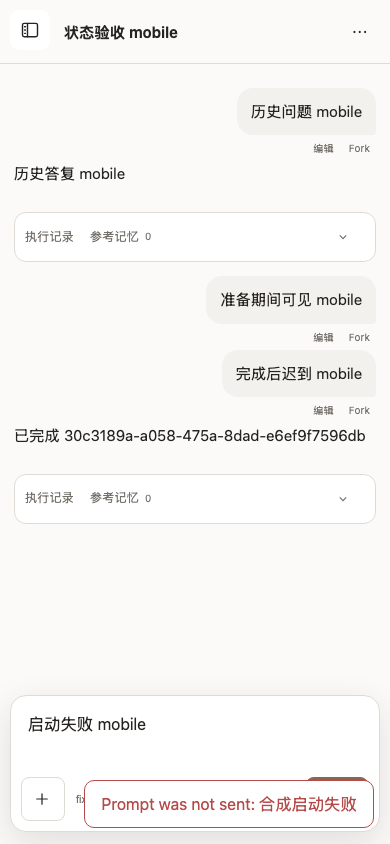

#### 5. 释放旧连接后另一端恢复，同一正文自动接到新连接

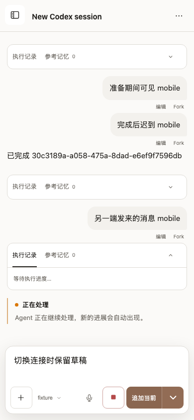

#### 6. 断线重连补齐完成状态，消息与草稿保留

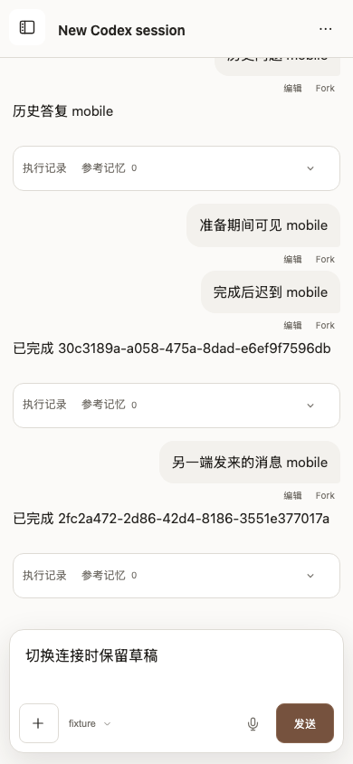

> URLs in the manifest are sanitized. Video and screenshots contain the rendered viewport; traces can contain request data and should be promoted or shared only after review.

