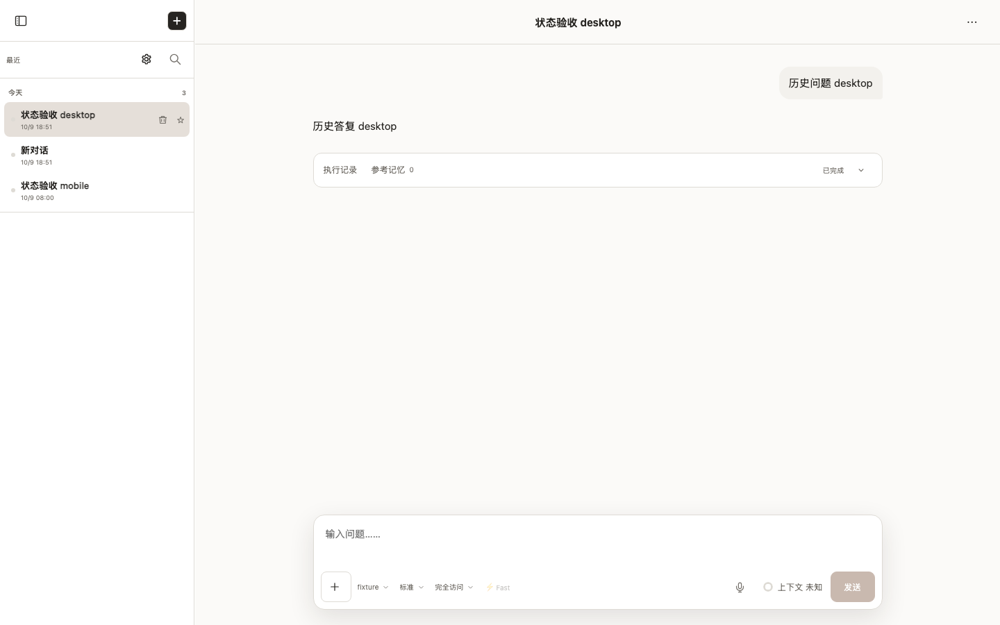
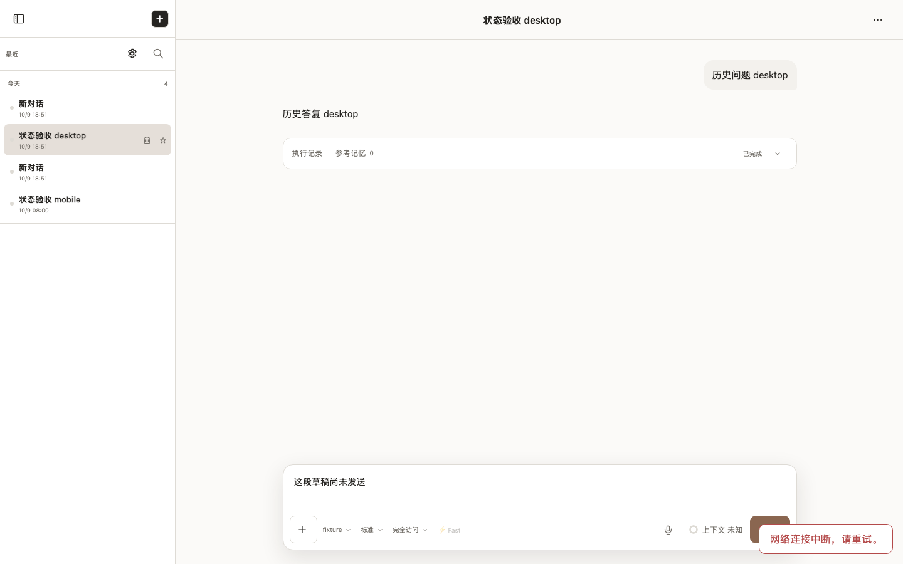
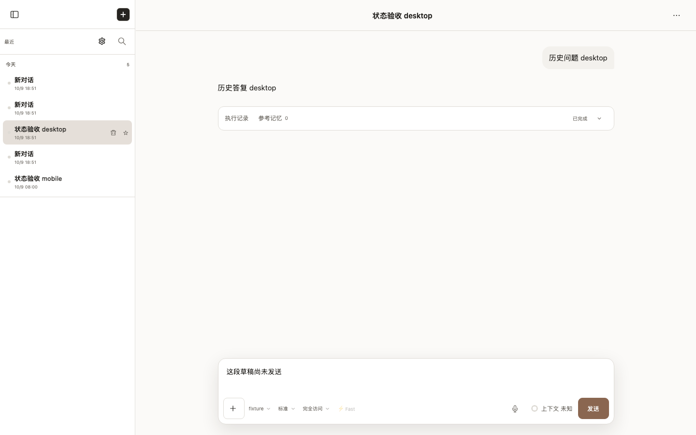
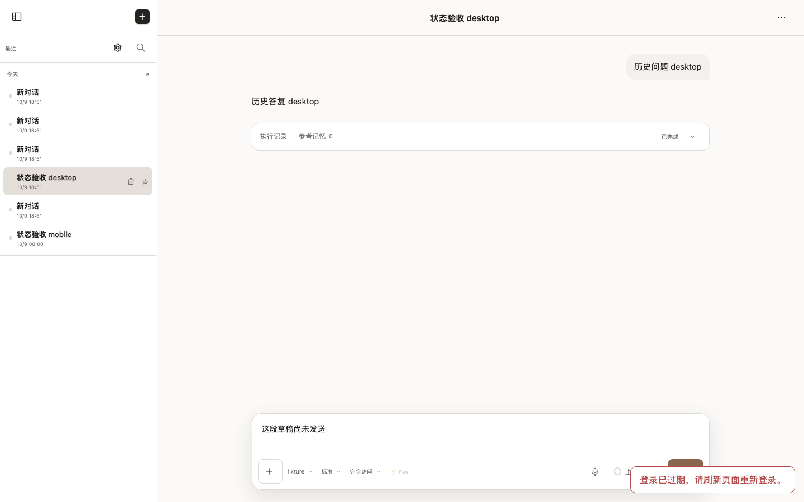
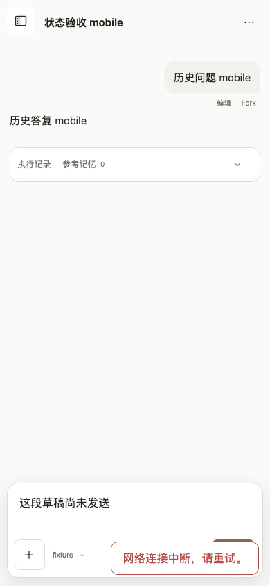
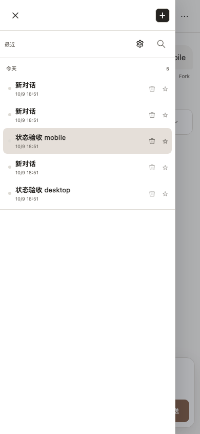
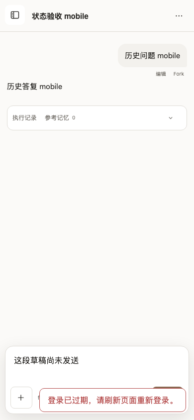

# session-transport-recovery

- Status: **passed**
- Started: 2026-10-09T10:51:50.355Z
- Flow: `/Users/mac/Documents/worktrees/CHG-20261009-004/agent-terminal-web/scripts/testing/session-transport-recovery.flow.mjs`

## desktop

Viewport: 1440 × 900. Status: **passed**.

### Video

- [Segment 1](desktop/video.webm)

### Storyboard

#### 1. 瞬时断网后自动恢复，正文两秒内出现

#### 2. 持续断网有明确提示，正文和草稿仍保留

#### 3. 连接恢复后切回会话，草稿可以继续编辑

#### 4. 登录过期显示明确提示，不再变成跨域读取失败

## mobile

Viewport: 390 × 844. Status: **passed**.

### Video

- [Segment 1](mobile/video.webm)

### Storyboard

#### 1. 瞬时断网后自动恢复，正文两秒内出现

#### 2. 持续断网有明确提示，正文和草稿仍保留

#### 3. 连接恢复后切回会话，草稿可以继续编辑

#### 4. 登录过期显示明确提示，不再变成跨域读取失败

> URLs in the manifest are sanitized. Video and screenshots contain the rendered viewport; traces can contain request data and should be promoted or shared only after review.

